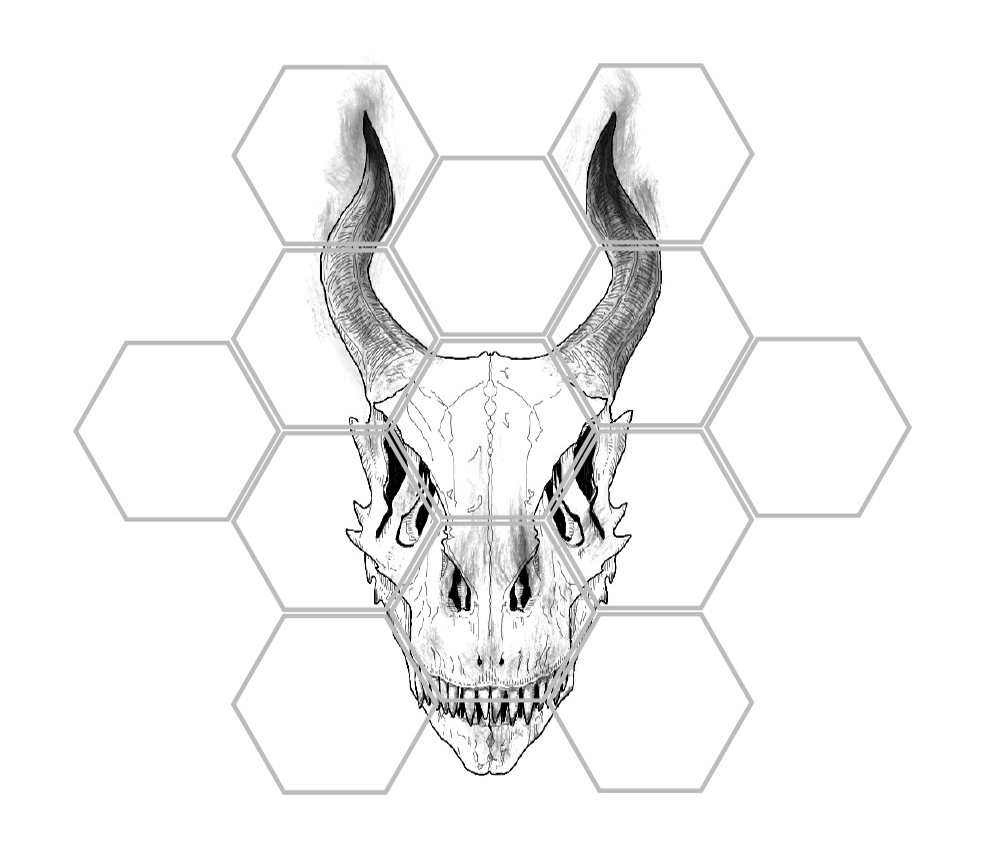

Bare Bones
================
bjhufstetler
2/12/2020

A [shiny](https://github.com/rstudio/shiny) (Chang et al. 2019) app to
play the new hit trading card game, Bare Bones, created by bjhufstetler
and available for purchase summer 2020.

<center>



</center>

This app was created as a submission for the [2020 shiny
contest](https://blog.rstudio.com/2020/02/12/shiny-contest-2020-is-here/).

To run the application locally use:

``` r
shiny::runGitHub(repo = "bjhufstetler/BareBones")
```

## Rules

### Overview

Bare Bones is played by each player placing hexagonal cards, one at a
time, onto a grid adjacent to previously played cards. The first card
played is called the *anchor* and must be placed in the center of the
grid. Each player is dealt six cards but only have access to two at a
time. When a card is placed, its edges are evaluated against their
neighbors to determine if any points are scored. Players can score
points by matching edge numbers or placing higher edge numbers against
existing cards. The player with the most points after all cards are
played is the winner. The first player to lay down a card wins in the
event of a tie.

### Choosing the first player

The first player is chosen randomly using `runif(1) < 0.5`. The first
player is given two bonus points and wins in the event of a tie. Again
the first card must be placed in the center of the grid.

### Placing cards

Cards can be selected by clicking on one of the cards on the left side
of the screen. This is your *hand*. You may rotate the cards by pressing
the left or right arrows on your keyboard. Cards may be placed in any of
the red hexagons on the grid, and in any orientation.

### Placing Chits

*Chits* are used to track each player’s score. You are placing white
chits and trying to capture black chits. A chit is placed on a card when
it is first laid down. Additional chits may be placed onto or removed
from neighboring cards given the overpowering and matching rules
described in the next section.

Multiple players may have chits on the same card but they cannot have
more than one chit on a single card. If you have the opportunity to
place a second chit on a card containing an opponent’s chit, you capture
the opponent’s chit, removing it from the board and adding it to your
score.

### Overpowering

A card is *overpowered* when a card is placed along its edge containing
a higher number on the shared edge. When a card is overpowered, the
player who placed the overpowering card places a chit of their color
onto the overpowered card.

### Matching

If **at least** two edges of a newly placed card *match* the numbers on
previously played cards, then a chit may be placed on each of the
matched cards, ***and*** the matched cards may attempt to *overpower*
their neighbors as if the matched cards had just been played. All edges
of a matched card may be evaluated, thus, if two matched cards are
adjacent to one another, one may overpower the other.

### AI

The AI uses a greedy algorithm but occassionally makes sub-optimal
decisions. Bare Bones is a game of chance and skill. It has been
empirically shown to be evenly balanced when each player uses the same
strategy and card distribution.

### Physical Game

Bare Bones will be going on sale in the Summer of 2020 as a physical
trading card game. The same rules apply with the addition that when a
game is played, the winner will take posession of one of their
opponent’s cards (of the winner’s choosing). There are five large
pieces of artwork in the initial release, each of which has been cut up
into hexagons and randomly distributed into the packs being sold. The
goal is to complete each work of art.

## Special Thanks and Recognition

The code used in this application was originally adapted from a contest
submission last year by [dreamRs](https://github.com/dreamRs/memory-hex)
(dreamRs 2019).

All artwork created by Eldyn Park.

## References

<div id="refs" class="references">

<div id="ref-shiny">

Chang, Winston, Joe Cheng, JJ Allaire, Yihui Xie, and Jonathan
McPherson. 2019. *Shiny: Web Application Framework for R*.
<https://CRAN.R-project.org/package=shiny>.

</div>

<div id="ref-dreamrs_2019">

dreamRs. 2019. “DreamRs/Memory-Hex.” *GitHub*.
<https://github.com/dreamRs/memory-hex>.

</div>

</div>
